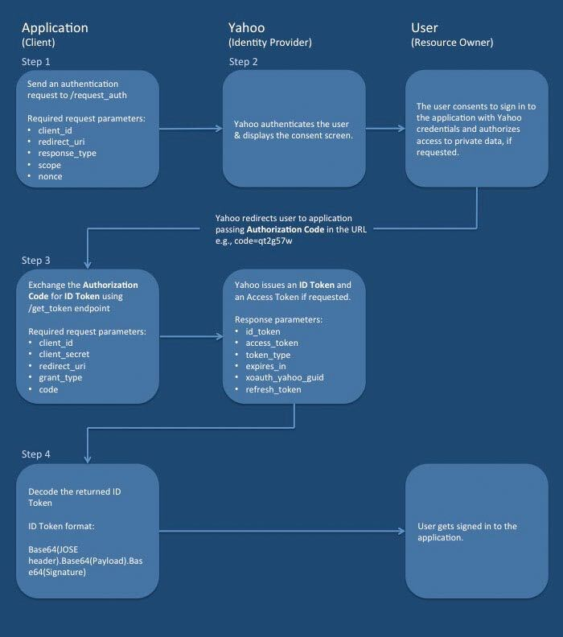
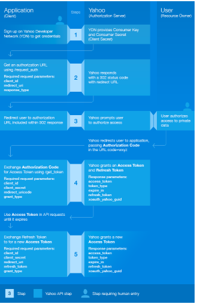

# OAuth Comparative Analysis

## OAuth Provider Name 
Yahoo provider.

### Research Conducted By: Student Names

Raghad Al-Qaruan
Israa Othman
Bushra Bilal
Fatema Al-Zahraa Owedah

### Overall Score and Comments
#### Score (Out of 10): 10 please :)

#### General Comments
- The application requests authorization to access service resources from the user
- If the user authorized the request, the application receives an authorization grant
- The application requests an access token from the authorization server (API) by presenting authentication of its own identity, and the authorization grant
- If the application identity is authenticated and the authorization grant is valid, the authorization server (API) issues an access token to the application. Authorization is complete.
- The application requests the resource from the resource server (API) and presents the access token for authentication
- If the access token is valid, the resource server (API) serves the resource to the application

#### Pros
* It has ability to share data for users without having to release personal information.

* It is easier to implement and provides stronger authentication.

#### Cons
* If you are adding more extension at the ends in the specification, it will produce a wide range of non-interoperable implementations, which means you have to write separate pieces of code for Facebook, Google, etc.
* If your favorite sites are connected to the central hub and the central account is hacked, then it will lead to serious effects across several sites instead of just one.

### Ratings and Reviews
#### Documentation

#### Systems Requirements
Above and beyond 'node' and 'linux', what dependencies or core requirements exist for this framework?
superagent, base-64, bcrypt, cors,dotenv,eslint, express, jsonwebtoken, morgan.
Can it play at AWS/Heroku?
yes in Heroku.

#### Ramp-Up Projections
How long would/should it take a team of mid-junior developers to become productive?Three months.

#### Community Support and Adoption levels
1. How popular is this framework?  
   Express -> the most popular Node. js framework available for the JavaScript community on GitHub  
2. What big companies are running on it?  
  - Netflix.
  - Linkedin. 
  - Trello. 
  - Uber. 
  - PayPal. 
  - Medium. 
  - eBay. 
  - NASA.
3. How is it "seen" in the general JS community?  
   - Most developers adore Node.js for its raw speed, and when it comes down to framework selection, a perfectionist may disdain any performance jeopardy  
   - it provides a thin layer on top of Node.js with web application features such as basic routing, middleware, template engine and static files serving, so the drastic I/O performance of Node.js doesn’t get compromised.  

4. Is there an active community of developers supporting and growing it?  
    yes like GitHub  

### Links and Resources
* [framework](https://www.yahoo.com/)
* [docs](https://developer.yahoo.com/oauth2/guide/flows_authcode/#step-5-exchange-refresh-token-for-new-access-token
)
* 

### Code Demos
* [live/running application](http://xyz.com) (not finish yet ...)
* [code repository](https://github.com/bushra-401-advanced-javascript/OAuth)

### Operating Instructions
If someone were to download your repo (above), what steps do they need to take to run the application
* `.env` requirment
* `npm start`,`nodemon`
* Endpoint: `/oauth`
  * Returns a Token
